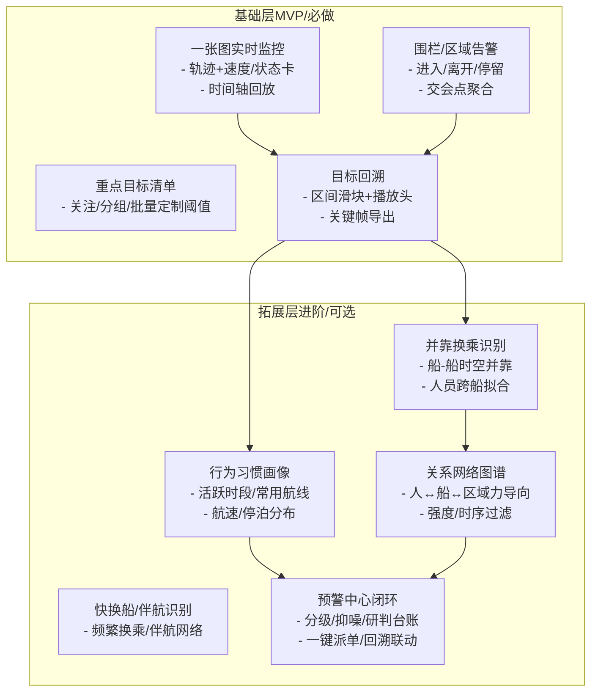

```mermaid
graph TD
  subgraph 基础层MVP/必做
    A1[一张图实时监控\n- 轨迹+速度/状态卡\n- 时间轴回放]
    A2[围栏/区域告警\n- 进入/离开/停留\n- 交会点聚合]
    A3[重点目标清单\n- 关注/分组/批量定制阈值]
    A4[目标回溯\n- 区间滑块+播放头\n- 关键帧导出]
  end
  subgraph 拓展层进阶/可选
    B1[行为习惯画像\n- 活跃时段/常用航线\n- 航速/停泊分布]
    B2[并靠换乘识别\n- 船-船时空并靠\n- 人员跨船拟合]
    B3[快换船/伴航识别\n- 频繁换乘/伴航网络]
    B4[关系网络图谱\n- 人↔船↔区域力导向\n- 强度/时序过滤]
    B5[预警中心闭环\n- 分级/抑噪/研判台账\n- 一键派单/回溯联动]
  end
  A1 --> A4
  A2 --> A4
  A4 --> B1
  A4 --> B2
  B2 --> B4
  B1 --> B5
  B4 --> B5
```