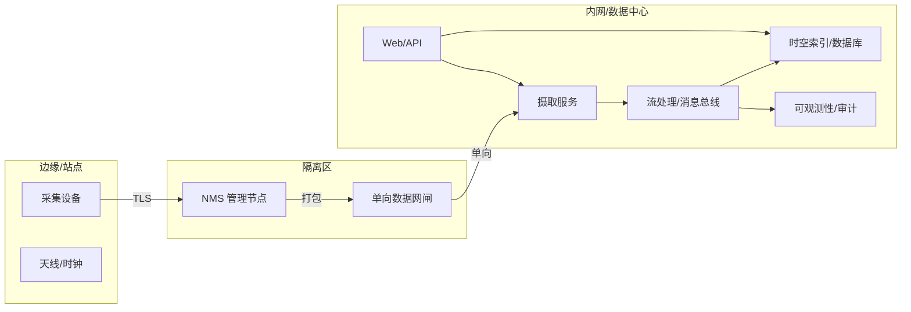

```mermaid
flowchart LR
  subgraph Edge[边缘/站点]
    Dev[采集设备]
    Ant[天线/时钟]
  end
  subgraph DMZ[隔离区]
    NMS[NMS 管理节点]
    Gate[单向数据网闸]
  end
  subgraph Intranet[内网/数据中心]
    Ingest[摄取服务]
    Stream[流处理/消息总线]
    Index[时空索引/数据库]
    Portal[Web/API]
    Obs[可观测性/审计]
  end
  Dev -->|TLS| NMS
  NMS -->|打包| Gate -->|单向| Ingest
  Ingest --> Stream --> Index
  Portal --> Ingest
  Portal --> Index
  Stream --> Obs

```