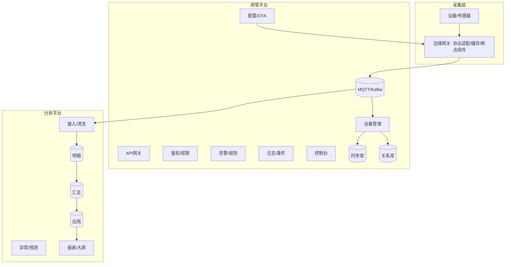

```mermaid
flowchart TB
subgraph Edge[采集层]
Dev[设备/传感器]
Gw[边缘网关: 协议适配/缓存/断点续传]
end
subgraph Platform[网管平台]
API[API网关]
Auth[鉴权/权限]
EM[设备管理]
ALM[告警/规则]
CFG[配置/OTA]
LOG[日志/事件]
UI[控制台]
MQ[(MQTT/Kafka)]
TSDB[(时序库)]
RDB[(关系库)]
end
subgraph Data[分析平台]
Ingest[接入/清洗]
DWD[(明细)]
DWS[(汇总)]
ADS[(应用)]
AI[异常/预测]
BI[报表/大屏]
end
Dev --> Gw --> MQ
MQ --> Ingest --> DWD --> DWS --> ADS --> BI
MQ --> EM
EM --> RDB & TSDB
CFG --> Gw
```