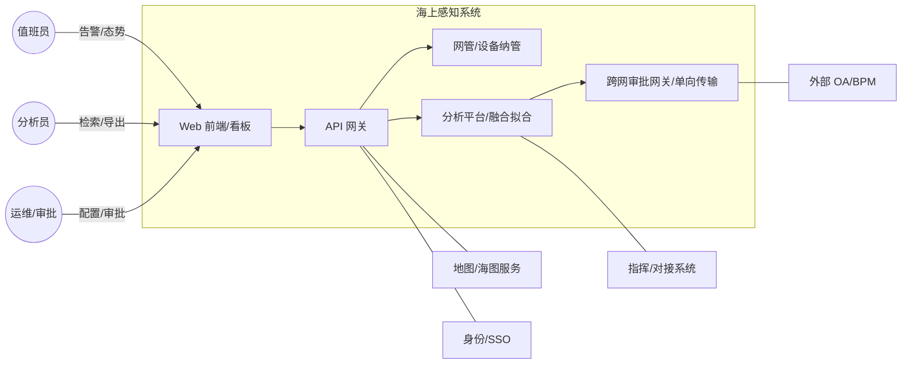

```mermaid
flowchart LR
  actorA((值班员))
  actorB((分析员))
  actorC((运维/审批))
  subgraph OurSystem[海上感知系统]
    Web[Web 前端/看板]
    API[API 网关]
    NMS[网管/设备纳管]
    DTX[跨网审批网关/单向传输]
    ANA[分析平台/融合拟合]
  end
  actorA -- 告警/态势 --> Web
  actorB -- 检索/导出 --> Web
  actorC -- 配置/审批 --> Web
  Web --> API
  API --> NMS
  API --> ANA
  ANA --> DTX
  DTX --- OA[外部 OA/BPM]
  API --- MAP[地图/海图服务]
  API --- SSO[身份/SSO]
  ANA --- EXT[指挥/对接系统]

```